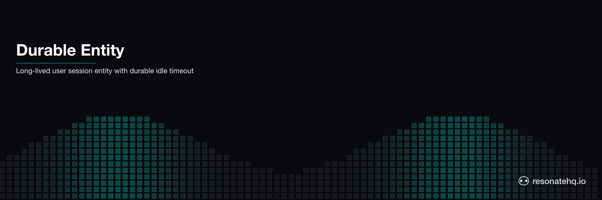

<p align="center">
  <picture>
    <source media="(prefers-color-scheme: dark)" srcset="./assets/banner-dark.png">
    <source media="(prefers-color-scheme: light)" srcset="./assets/banner-light.png">
    
  </picture>
</p>

# Durable Entity (User Session)

A long-lived user session entity modeled as a durable workflow. The session tracks login, activity recording, an idle timeout, expiry, and cleanup — all as durable checkpoints. If the process crashes mid-session, it resumes exactly where it left off: no activities are double-recorded, the idle timer picks up from where it paused.

## What This Demonstrates

- **Entity as workflow**: the session entity IS the generator — no separate state store or K/V API required
- **Durable activity tracking**: each activity is an independent checkpoint; crash mid-recording, resume from that activity, earlier activities not re-recorded
- **Durable sleep for idle timeout**: `ctx.sleep()` survives crashes — a crash during the idle period doesn't restart the timer (in production: 30-minute session timeout; in demo: 100ms)
- **Exactly-once cleanup**: revoke tokens and clear cache exactly once, even if the cleanup step is retried

## How It Works

The session lifecycle is a generator function. The entity's state is accumulated in a local variable — no `ctx.get`/`ctx.set` needed:

```typescript
export function* sessionLifecycle(ctx: Context, sessionId: string, userId: string, activities: Activity[], idleTimeoutMs: number, crashOnActivity: string | null) {

  // Login: JWT issued, session initialized
  let state = yield* ctx.run(loginSession, sessionId, userId);

  // Activity tracking: each is an independent checkpoint
  for (const activity of activities) {
    state = yield* ctx.run(recordActivity, sessionId, state, activity, activity.type === crashOnActivity);
  }

  // Mark idle, then wait out the timeout
  state = yield* ctx.run(markIdle, sessionId, state);
  yield* ctx.sleep(idleTimeoutMs);  // ← durable: crash here, timer resumes

  // Expire and clean up
  state = yield* ctx.run(expireSession, sessionId, state);
  state = yield* ctx.run(cleanupSession, sessionId, state);

  return { ...state };
}
```

On crash and resume, Resonate replays the generator. Each `yield*` checks the promise store first. Completed activities return cached results — no re-recording. The `ctx.sleep()` resumes from wherever it was when the crash happened.

### Restate Comparison

Restate models this as a Virtual Object — a keyed service with built-in K/V storage:

```typescript
// Restate: state lives in K/V store
const userFeed = restate.object({
  name: "userFeed",
  handlers: {
    processPost: async (ctx: restate.ObjectContext, post: Post) => {
      const postId = await ctx.run(() => createPost(userId, post));

      // Poll with sleep until content moderation passes
      while ((await ctx.run(() => getPostStatus(postId))) === PENDING) {
        await ctx.sleep({ seconds: 5 });
      }

      await ctx.run(() => updateUserFeed(userId, postId));
    },
  },
});
```

Resonate's approach: state is a JavaScript variable passed through `ctx.run()` calls, accumulated in the generator. No object declaration, no `ctx.get`/`ctx.set`. The entity's lifecycle is expressed as sequential code.

## Prerequisites

- [Bun](https://bun.sh) v1.0+

No external services required. Resonate runs in embedded mode.

## Setup

```bash
git clone https://github.com/resonatehq-examples/example-durable-entity-ts
cd example-durable-entity-ts
bun install
```

## Run It

**Normal mode** — all activities recorded, idle timeout fires, session cleaned up:
```bash
bun start
```

```
=== Durable User Session Entity ===
Mode: NORMAL (all activities recorded, idle timeout, cleanup)
Session: sess_1771899691132

  [sess_...]  User user_alice_42 logged in  ✓
  [sess_...]  Activity 'page_view'  ✓
  [sess_...]  Activity 'search'  ✓
  [sess_...]  Activity 'product_view'  ✓
  [sess_...]  Activity 'add_to_cart'  ✓
  [sess_...]  Activity 'checkout_started'  ✓
  [sess_...]  Session idle — waiting for timeout...
  [sess_...]  Session expired (idle timeout reached)  ✓
  [sess_...]  Session cleaned up (tokens revoked, cache cleared)  ✓

=== Result ===
{
  "finalStatus": "cleaned_up",
  "activitiesRecorded": 5,
  "wallTimeMs": 446
}
```

**Crash mode** — database times out writing `checkout_started`, retries once:
```bash
bun start:crash
```

```
  [sess_...]  Activity 'page_view'  ✓
  [sess_...]  Activity 'search'  ✓
  [sess_...]  Activity 'product_view'  ✓
  [sess_...]  Activity 'add_to_cart'  ✓
  [sess_...]  Activity 'checkout_started'  ✗  (database write timeout)
Runtime. Function 'recordActivity' failed with 'Error: ...' (retrying in 2 secs)
  [sess_...]  Activity 'checkout_started' (retry 2)  ✓
  [sess_...]  Session idle — waiting for timeout...
  [sess_...]  Session expired (idle timeout reached)  ✓
  [sess_...]  Session cleaned up (tokens revoked, cache cleared)  ✓

Notice: page_view, search, product_view, add_to_cart each logged once (completed before crash).
Only checkout_started was retried — and only once.
```

## What to Observe

1. **No double-recording**: in crash mode, the four activities before the crash each appear exactly once in the output. Resonate serves them from the promise cache.
2. **Retry message from the SDK**: `Runtime. Function '...' failed (retrying in N secs)` is the SDK. No retry logic needed in your code.
3. **Durable sleep**: in normal mode, the 100ms idle timeout is a `ctx.sleep()` call. In production this would be 30 minutes — and a crash during that window would NOT restart the clock.
4. **State accumulated, not stored**: the `state` variable in the workflow is rebuilt on replay by re-executing `ctx.run()` calls (which return cached results). There is no external state store.

## File Structure

```
example-durable-entity-ts/
├── src/
│   ├── index.ts    Entry point — Resonate setup and demo runner
│   ├── workflow.ts Session lifecycle generator — the entity
│   └── session.ts  Session operations (login, record, expire, cleanup)
├── package.json
└── tsconfig.json
```

**Lines of code**: ~306 total, ~45 lines of entity logic (workflow.ts minus comments).

## Comparison

| | Resonate | Restate |
|---|---|---|
| Entity model | Long-running generator | Virtual Object (keyed service) |
| State storage | Local JS variable in generator | K/V store (`ctx.get`/`ctx.set`) |
| Concurrent access | Same workflow ID = idempotent | Per-key exclusive lock |
| Time-based behavior | `ctx.sleep()` (durable) | `ctx.sleep()` (durable) |
| Entity code | ~45 LOC | ~60 LOC (`eventtransactions/user_feed.ts`) |
| Infrastructure | None | Restate server |

Restate's Virtual Object serializes concurrent calls per key — two HTTP requests racing to update the same session are automatically queued. Resonate's model is different: the workflow is the entity, and the promise ID acts as the mutex (same ID = same idempotent result). For truly concurrent mutation from multiple callers, Restate's explicit per-key locking model has advantages. For the common case — one session, one execution path — Resonate's generator model is simpler.

## Learn More

- [Resonate documentation](https://docs.resonatehq.io)
- [Restate event transactions (Virtual Object + Kafka)](https://github.com/restatedev/examples/tree/main/typescript/patterns-use-cases/src/eventtransactions)
- [Restate virtual objects intro](https://github.com/restatedev/examples/blob/main/typescript/basics/src/2_virtual_objects.ts)
